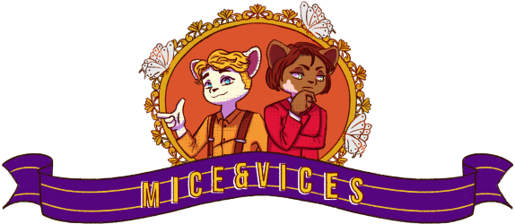
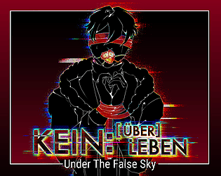

 

<h1>2025 </h1>
 
<h2> Mice and Vices  </h2>

Together, two mice detectives, Raz Berries and Sunny Whisk, investigate a museum robbery as they travel to Twintails, Raz's hometown. 
This game was part of a thesis project - and I collaborated by being a play-tester and proofreader for the script while also being a mentor for the programmer of the game dev group.   
 
As a play-tester, I focused on identifying and reporting critical bugs, evaluating the puzzle difficulty, and assessing the overall user experience flow. My role as proofreader involved meticulously checking the script for grammatical errors, consistency in character dialogue, and ensuring the mystery narrative was clear and engaging for the player.
   

Download and play this cute mystery <a href="https://jeblyfish.itch.io/mice-vices"> game</a> here!

 
<h1>2024 </h1>
 
 
<h2> Under the False Sky | Kein:[Über]Leben  </h2>

Taking place eight years before Under the False Sky [RE]:Idealize, Under the False Sky | Kein:[Über]Leben tells the story of the rebellion colony struggling for surivial as winter approaches. This story highlights  internal struggles, personal sacrifices, and the intricate dynamics of family relationships.    
For UTFS | Kein:[Über]Leben, I was one of the editors. This game was submitted to Winter VN Jam 2024 and Dying Year VN Jam 2024. Download and play the <a href="https://elduator.itch.io/utfs-keinueberleben">game</a> here!  
In my editing role, I performed comprehensive script reviews to enhance the emotional weight and pacing of the story's dramatic elements. I focused on maintaining narrative consistency across multiple character arcs and polished the text to ensure a professional and impactful reading experience for the player.
  

 
<h2>Under the False Sky [heca; tomb]</h2>
 Under the False Sky [heca; tomb], a prequel to the Under The False Sky Series, chronicles the journey of scientists who, while investigating mysterious disasters, stumble upon a secluded tribe's secret. Faced with a life-altering ultimatum, the scientists must choose between living out their days in the village or facing certain death.  
 
For UTFS [heca; tomb], I was an editor. UTFS [heca;tomb] was submitted to Josei After Dark 2024. Download and play the <a href="https://elduator.itch.io/hecatomb"> game</a>. Currently, the demo is out, and the full release is coming soon!
  
As an editor, I worked closely with the team to refine the dialogue, focusing on making the ethical dilemmas and high-stakes choices feel impactful. I meticulously reviewed the script for clarity, flow, and consistency, ensuring the tone matched the intense, mystery-driven atmosphere of the story.

 
<h2>Under The False Sky [IM]Pulse</h2>
 Under The False Sky [IM]Pulse is a short story that delves into the evolving relationship between Tamara and Felix, set after the events of UTFS | [Re]: Idealize. Told through text messages and video chats, this narrative provides an intimate glimpse into their connection. 
 
For UTFS [IM]Pulse, I was an editor. This game was made for O2A2 VN Jam 2024, a micro Visual Novel jam with strict asset limitations and a 1000-word limit. Play the game on your browser on itch.io or download it <a href= "https://elduator.itch.io/utfs-impulse">here</a>!
  
Despite the 1000-word limit, my editing role was crucial for maximizing the story's emotional effect and narrative economy. I ensured every line of the text-message and video-chat dialogue felt authentic, concise, and effectively conveyed the depth of the characters' evolving relationship.

 
<h2>Chromatic Agape</h2>
 Sev, a medical graduate, finds themselves transported into the world of their childhood painting. Confronted by villainous pixies and revered by colorful heroes, Sev embarks on a quest to uncover the true intentions of their creations.  
 
For <a href="https://deniz-g-lerosi.itch.io/chromatic-agape">Chromatic Agape</a>, I was an assets programmer and one of the editors for the NaNoRen2024 and OtomeJam2024 release.
  
As an assets programmer, I was responsible for integrating all visual and audio assets into the Ren'Py engine, ensuring smooth transitions and proper layering of sprites, backgrounds, and music. In my editor role, I focused on making the fantasy dialogue sound whimsical yet meaningful, maintaining consistency across the dual narrative of the protagonist's real and painted worlds.

 
