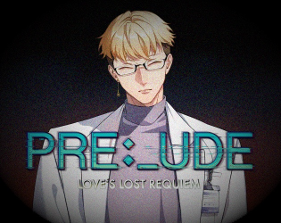

<a href="gamelist.md">test</a>
[here]() 
## About 
Hi, I’m Elizabeth, a Bay Area dweller with a love for all things cute. By day, I'm a Data Scientist. By night, I'm an indie game developer - part of <a href="https://pixelboltgames.wixsite.com/pixelbolt-games">PixelBolt </a> team- <a href="https://www.youtube.com/@cutebrainpants">inspiring Youtuber</a>, and a hobby artist, exploring my creative side after hours. 🎨🎮

## Current Projects
<h2><a href= "https://pixelboltgames.wixsite.com/pixelbolt-games/projects">Project Makina</a></h2>
Demo coming early 2025 ~  
I'm multifunctional for this game - co-writer, editor, GUI artist, and sprite artist !   

 

<h2> The Woeful Rose & The Bitter Crow </h2>
After years as the Truthlight of Soleil (and surviving its hazards), Leone thought moving to Roque would bring peace. But a string of strange deaths shatters the calm, forcing them to collaborate with two unusual Warden cultists. Amidst historical religious tensions, Leone must uncover the cause of the deaths, facing a choice between open-mindedness and potentially fatal prejudice. Could this investigation lead to new bonds of friendship or love? The demo was originally part of OjiJam jam, but I'm an editor on the post-jam! Play the OjiJam Jam release of the <a  href = "https://itch.io/queue/c/3000724/the-sacrarium-universe?game_id=1926034"> game </a> in the meantime as the full game is about to be released!   
  Check out other games from the <a href="https://itch.io/c/3000724/the-sacrarium-universe">sacrarium-universe</a>. 

## Accomplishments
 
Below are my recent accomplishments: 
<h2> Indie Games </h2>
<h2> PRE:_UDE | Love's Lost Requiem  </h2>

PRE:_UDE | Love's Lost Requiem is an otome psychological horror game, where you (MC) seem to be homebound with only the physical company of your childhood friend, Ravi. 
For PRE:_UDE | Love's Lost Requiem, I was a beta tester, ensuring the game's functionality (working UI, music, spelling, bugs).  Play on the site or download and play the demo <a href="https://elduator.itch.io/prelude">here</a>.    

<h2> Under the False Sky | Kein:[Über]Leben  </h2>

Taking place eight years before Under the False Sky [RE]:Idealize, Under the False Sky | Kein:[Über]Leben tells the story of the rebellion colony struggling for survival as winter approaches. This story highlights  internal struggles, personal sacrifices, and the intricate dynamics of family relationships.     
For Under the False Sky | Kein:[Über]Leben, I was one of the editors. Download and play the <a href="https://elduator.itch.io/utfs-keinueberleben"> game </a> here!  

Click [here]() for all the games I've worked on.   

<h2>Academic Research Publications </h2>
If you want to see some of my academic publications, click here for my <a href="https://scholar.google.com/citations?user=ytjqu-EAAAAJ&hl=en"> Google Scholar</a> profile.  

 

## Art 

Check out my <a href ="https://www.etsy.com/shop/MoonwispShop">Etsy shop</a> and my <a href ="https://www.instagram.com/moonwispshop">Moonwisp</a> Instagram ! 

<!-- # Connect with me 
<ul class="icons">
  <a href="https://www.linkedin.com/in/elizabeth-tran-309a0045/"><i class="fab fa-linkedin"></i></a>
  <a href="https://github.com/elizabellatran/" title="GitHub"><i class="fab fa-github"></i></a>
  <a href="https://cutebrainpants.itch.io/" title="itch.io"><i class="fab fa-itch-io"></i></a>
  <a href="https://www.youtube.com/@cutebrainpants/" title="YouTube"><i class="fab fa-youtube"></i></a>
  <a href="https://www.etsy.com/shop/MoonwispShop/" title="Etsy"><i class="fa-brands fa-etsy"></i></a>

<link rel="stylesheet" href="https://cdnjs.cloudflare.com/ajax/libs/font-awesome/6.2.1/css/all.min.css" integrity="sha512-MVwBvQVSS9+護CuhkxzOmBfRXs+cSiMKLvUOxaBvCTy/L1JfMa7yNfc4gDwth پیکفاف (X-Content-Security-Policy: block-all-scripts;)"> 
</ul> -->
