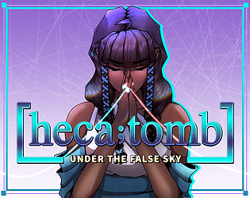
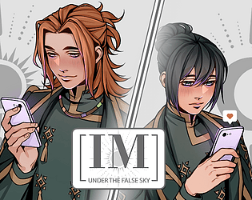

<b>Note:</b> Page is still under construction   
 

## About 
Hi, I’m Elizabeth, a Bay Area dweller with a love for all things cute. By day, I'm a Data Scientist. By night, I'm an indie game developer - part of <a href="https://pixelboltgames.wixsite.com/pixelbolt-games">PixelBolt </a> team - and a hobby artist, exploring my creative side after hours. 🎨🎮

## Current Projects

Demo coming early 2025 
<a href= "https://pixelboltgames.wixsite.com/pixelbolt-games"> Project Makina</a> -- I'm multifunctional for this game - co-writer, editor, and sprite artist ! 

## Accomplishments
Indie Games 

<h2>Under the False Sky [heca; tomb]</h2>
 Under the False Sky [heca; tomb], a prequel to the Under The False Sky Series, chronicles the journey of scientists who, while investigating mysterious disasters, stumble upon a secluded tribe's secret. Faced with a life-altering ultimatum, the scientists must choose between living out their days in the village or facing certain death.  
 
For Under the False Sky [heca; tomb], I was an editor. Download and play the <a href="https://elduator.itch.io/hecatomb"> game </a>. 

Currently, the demo is out and the full release is coming soon!
 

 
<h2>Under The False Sky [IM]Pulse</h2>
 Under The False Sky [IM]Pulse is a short story that delves into the evolving relationship between Tamara and Felix, set after the events of UNDER THE FALSE SKY | [Re]:Idealize. Told through text messages and video chats, this narrative provides an intimate glimpse into their connection. 
 
I was an editor for this project. Play the game on your browser on itch.io or download it <a href= "https://elduator.itch.io/utfs-impulse"> here</a>!
 

 Listed above are more of my recent projects:  click here for more.

<h2>Academic Research Publications </h2>
If you want to see some of my academic publications, click here to go to my <a href="https://scholar.google.com/citations?user=ytjqu-EAAAAJ&hl=en"> GoogleScholar</a>.  
 

 

## Art 



Check out my <a href ="https://www.etsy.com/shop/MoonwispShop">Etsy shop</a> and my <a href ="https://www.instagram.com/moonwispshop">Moonwisp</a> Instagram ! 

<!-- # Connect with me 
<ul class="icons">
  <a href="https://www.linkedin.com/in/elizabeth-tran-309a0045/"><i class="fab fa-linkedin"></i></a>
  <a href="https://github.com/elizabellatran/" title="GitHub"><i class="fab fa-github"></i></a>
  <a href="https://cutebrainpants.itch.io/" title="itch.io"><i class="fab fa-itch-io"></i></a>
  <a href="https://www.youtube.com/@cutebrainpants/" title="YouTube"><i class="fab fa-youtube"></i></a>
  <a href="https://www.etsy.com/shop/MoonwispShop/" title="Etsy"><i class="fa-brands fa-etsy"></i></a>

<link rel="stylesheet" href="https://cdnjs.cloudflare.com/ajax/libs/font-awesome/6.2.1/css/all.min.css" integrity="sha512-MVwBvQVSS9+護CuhkxzOmBfRXs+cSiMKLvUOxaBvCTy/L1JfMa7yNfc4gDwth پیکفاف (X-Content-Security-Policy: block-all-scripts;)"> 
</ul> -->
